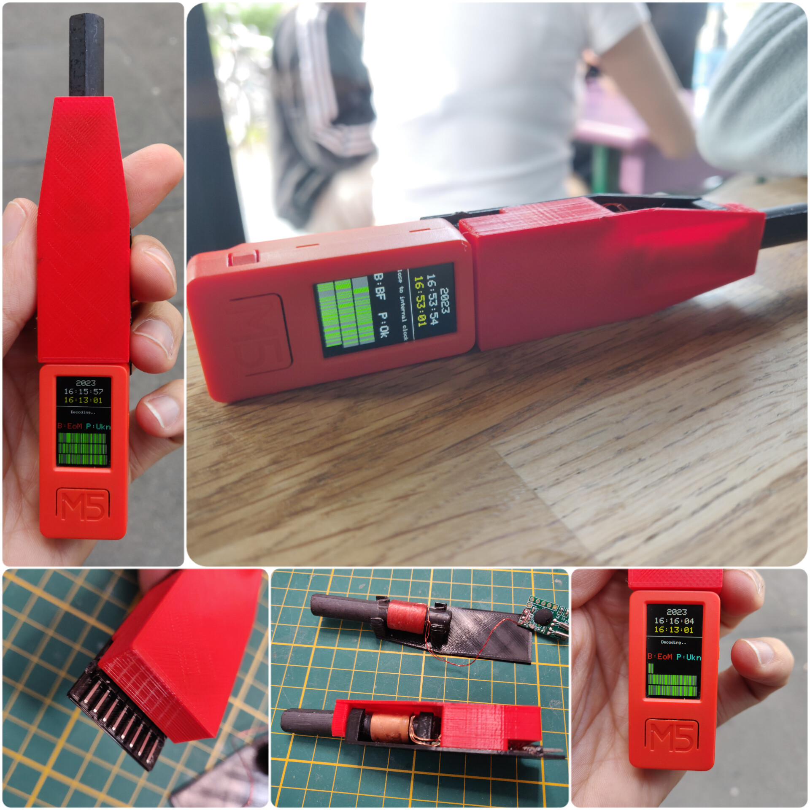

# M5StickC DCF77 HAT

Basic hat implementation of a DCF77 receiver for M5StickC-Plus or compatible ESP32 devices. This firmware uses a improvement of Arduino-DCF77 library, it is using events callback to improve the GUI and signal representation.

## Device

The current firmware was tested on 77.5KHZ single frequency device. It is the 4 pins version and it was bought here in [Aliexpress](https://www.aliexpress.com/item/1005005254051736.html).

## Wiring

| M5StickC pin | DCF77 pin | Description |
|:----:|:----:|:-------------|
| 0 | P | PON: Enable/Disable |
| 26 | T | Interrupt pin or data |
| 3.3v | VDD | Positive (3.3v) |
| GND  | GND | Ground / unlabeled pin |

(see the photos in [Thingiverse](https://www.thingiverse.com/thing:6033436))

## Usage

**Some tips:**  

- [x] check the right device. Some devices has different frequencies for each country.
- [x] Try to remove the device from any radio or wireless intereference or noise. The radio is very susceptible to noise.
- [x] In indoors works, but is possible that in some builds doesn't. Try in outdoors first
- [x] the position of the device for me was important, in horizontal is possible that it works better

**Buttons:**

- Left button: Power ON/Off
- M5 Button: Backlight or brightness toggle
- Right button: Unimplementened  

## Box

Is a basic box - hat for these devices, for example M5StickC or M5StickC-Plus, also should be work in M5CoreInk device.

**Files:**  

  
  

Also in [Thingiverse](https://www.thingiverse.com/thing:6033436).  

---

## Credits

https://github.com/thijse/Arduino-DCF77 (Old library)  
https://www.seikowatches.com/instructions/html/SEIKO_8B92_EN/CWVVSYxxhbpilh